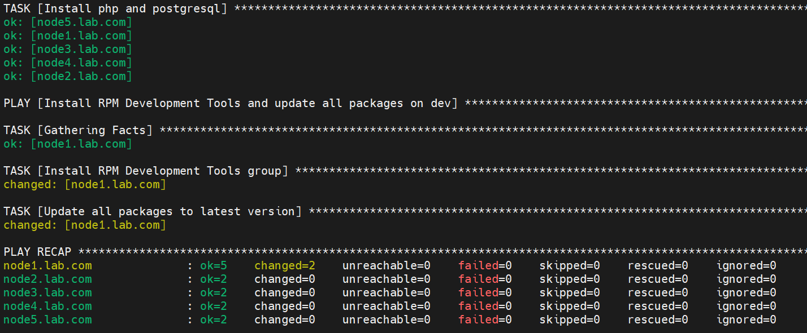

This repository will provide solutions to the Red Hat Certified Engineer (RHCE EX294) exam preparation tasks. Tasks will be executed using Rocky Linux 9 systems in an Oracle VirtualBox environment. 

## Question 1 
### 1.1 Preparing the environment in VirtualBox
  

control.lab.com - control node (Ansible)    
node1.lab.com - managed node  
node2.lab.com - managed node  
node3.lab.com - managed node  
node4.lab.com - managed node  
node5.lab.com - managed node  

```bash
cat /etc/hosts
```
  

### 1.2 Creating the user 'automation' on a control node and managed nodes

```bash
 useradd automation
 echo "devops" | passwd --stdin automation
 usermod -aG wheel automation
```

### 1.3 Passwordless SSH Configuration on control.lab.com
```bash
ssh-keygen -t rsa
ssh-copy-id node1.lab.com
ssh-copy-id node2.lab.com
ssh-copy-id node3.lab.com
ssh-copy-id node4.lab.com
ssh-copy-id node5.lab.com
```

### 1.4 Executing sudo commands without requiring a password on managed nodes

Ansible will execute the command with elevated privileges (become: true). This grants the automation user the ability to execute any commands with sudo without requiring a password on managed hosts. Add the following to the /etc/sudoers file:

automation ALL=(ALL) NOPASSWD: ALL

### 1.5 Ansible installation and configutation on control.lab.com
```bash
dnf install ansible-core python3-pip vim -y
su - automation
pip install ansible-navigator
```

Creating directories and configuring
```bash
mkdir -p /home/automation/ansible/mycollection
mkdir -p /home/automation/ansible/roles
chown -R automation:automation /home/automation
```

/home/automation/plays/ansible.cfg

 [defaults]  
 inventory = /home/automation/ansible/inventory  
 roles_path = /home/automation/ansible/roles  
 collections_path = /home/automation/ansible/mycollection  
 remote_user = automation  
 host_key_checking = False  
 [privilege_escalation]  
 become = True  
 become_method = sudo  
 become_user = root  
 become_ask_pass = false  

 /home/automation/plays/inventory/hosts  


[dev]  
node1.lab.com  
[test]  
node2.lab.com  
[prod]  
node3.lab.com  
node4.lab.com  
[balancers]  
node5.lab.com  
[webservers:children]  
prod  
 

Then we execute the command:

```bash
ansible --version
```
returns in this case "/home/automation/ansible.cfg"

We add an entry and check it:
```bash
echo "export ANSIBLE_CONFIG=/home/automation/ansible.cfg" >> .bashrc
cat .bashrc
```
We add the source:
```bash
source .bashrc
```

### 1.6 Connection test

Log in to your automation account on control.lab.com. 

```bash
cd /home/automation/plays
ansible all --list-hosts
ansible all -m ping
```

  

## Question 2  
Create and run an Ansible ad-hoc command. As a system administrator, you will need to install software on the managed node.  
a -  Create a shell script called yum-repo.sh that runs Ansible ad-hoc commands to create the yum repositories on ech of the managed nodes as per the followind details.  
b - NOTE: you need to create 2 repos (BaseOS & AppStream) un the managed nodes.   

[BaseOS]  
name = BaseOS  
baseurl = file:///mnt/BaseOS/  
description : Base OS Repo  
gpgcheck = 1  
enabled = 1  
gpkey: file:///etc/pki/rpm-gpg/RPM-GPG-KEY-redhat-release  

 
[AppStream]  
name = AppStream  
baseurl = file:///mnt/AppStream/  
description : AppStream Repo  
gpgcheck = 1  
enabled = 1  
gpkey: file:///etc/pki/rpm-gpg/RPM-GPG-KEY-redhat-release  

```bash
cd ansible/
nano yum-repo.sh
```

```bash
#!/bin/bash

ANSIBLE_CONFIG=/home/automation/ansible/ansible.cfg

ansible all -m copy -a "content='[BaseOS]
name=BaseOS
baseurl=file:///mnt/BaseOS/
enabled=1
gpgcheck=1
gpgkey=file:///etc/pki/rpm-gpg/RPM-GPG-KEY-redhat-release
' dest=/etc/yum.repos.d/baseos.repo"

ansible all -m copy -a "content='[AppStream]
name=AppStream
baseurl=file:///mnt/AppStream/
enabled=1
gpgcheck=1
gpgkey=file:///etc/pki/rpm-gpg/RPM-GPG-KEY-redhat-release
' dest=/etc/yum.repos.d/appstream.repo"
```

```bash
chmod +x yum-repo.sh
./yum-repo.sh
ansible all -m command -a 'dnf repolist all'
ansible all -m command -a 'ls /etc/yum.repos.d/' -b
```
Checking if repository files have been created in node1.lab.com:  

  

## Question 3 
Create a playbook called /home/automation/automation/ansible/packages.yml that:  
- Installs the php and postgresql packages on hosts in the dev, test, and prod host groups only.  
- Installs the RPM Development Tools package group on hosts in the dev host group only.  
- Updates all paclages to the lates veriosn on hosts in the dev host group only.  

```bash
nano /home/automation/ansible/packages.yml
```
Utworzenie plabooka do instalowania PHP, PostgreSQL, RPM Developlment Tools i aktualizacji:

```bash
---
- name: Install PHP and PostgreSQL  on dev, test, and prod
  hosts: all
  become: yes
  tasks:
    - name: Install php and postgresql
      package:
        name:
          - php
          - postgresql
        state: present

- name: Install RPM Development Tools and update all packages on dev
  hosts: dev
  become: yes
  tasks:
    - name: Install RPM Development Tools group
      dnf:
        name: "@RPM Development Tools"
        state: present

    - name: Update all packages to latest version
      dnf:
        name: "*"
        state: latest
```

Execute the Playbook:

```bash
ansible-playbook /home/automation/ansible/packages.yml
```

  

Create a Playbook that will uninstall anything previously installed:

```bash
---
- name: Uninstall PHP and PostgreSQL from all environments
  hosts: all
  become: yes
  tasks:
    - name: Remove php and postgresql
      package:
        name:
          - php
          - postgresql
        state: absent

- name: Uninstall RPM Development Tools and revert updates on dev
  hosts: dev
  become: yes
  tasks:
    - name: Remove RPM Development Tools group
      dnf:
        name: "@RPM Development Tools"
        state: absent

    - name: Downgrade all packages to base version (optional)
      shell: |
        dnf distro-sync -y
      args:
        warn: false
      register: sync_result

    - name: Show downgrade result
      debug:
        var: sync_result.stdout_lines
```

## Question 4

Install the RHEL system roles package and create a playbook called:  
/home/automation/ansible/timesync.yml  
1. Runs on all the managed hosts.  
2. Uses the timesync role.  
3. Configure the role to use the time server 0.pool.ntp.org  
4. Configures the role to set the iburst parameter as enabled.  

```bash
dnf install rhel-system-roles -y
nano /home/automation/ansible/timesync.yml
```

Create a Playbook:

```bash
--- 
- name: Time Sync  
  hosts: all  
  become: true
  vars:  
    timesync_ntp_servers:
      - hostname: 0.pool.ntp.org
        iburst: yes  
  roles:
    - /usr/share/ansible/roles/rhel-system-roles.timesync
```

Execute the Playbook:

```bash
ansible-playbook /home/automation/ansible/timesync.yml
```
  
The iburst option in NTP involves sending eight queries to servers simultaneously during the initial synchronization.  

Create a Playbook that will uninstall anything previously installed:

```bash
---
- name: Revert Time Sync Configuration
  hosts: all
  become: true
  tasks:

    - name: Restore default chrony.conf from package
      copy:
        src: /usr/share/chrony/chrony.conf.rpmnew
        dest: /etc/chrony.conf
        remote_src: yes
      when: ansible_facts['distribution'] == "Rocky"

    - name: Ensure chronyd is enabled and running
      systemd:
        name: chronyd
        state: started
        enabled: yes

    - name: Remove custom timesync configuration file (if created by role)
      file:
        path: /etc/timesyncd.conf
        state: absent

    - name: Remove override timesync settings (if any)
      file:
        path: /etc/systemd/timesyncd.conf
        state: absent

    - name: Disable systemd-timesyncd if enabled
      systemd:
        name: systemd-timesyncd
        state: stopped
        enabled: no
        masked: yes
```

## Question 5

Create a role called apache in /home/automation/ansible/roles with the following requirem.  
5.1 The httpd package should be installed, httpd service should be enabled on boot, and started.  
5.2 The firewall is enabled and running with a rule to allow access to the web server.  
5.3 A template file index.html.j2 exists (you have to create this file) and is used  
/var/www/html/index.html with the following output: Welcome to HOSTNAME  
hostname is the fully qualified domain name of the managed node and ip address the managed node.  
5.4 Create a playbook called /home/automation/ansible/apache-role.yml that uses this role a (illegible) The playbook runs on hosts in the webservers host group.  


```bash
mkdir -p /home/automation/ansible/roles/apache/{tasks,templates,files,defaults,vars}
```
Creating an Apache role:  
```bash
nano /home/automation/ansible/roles/apache/tasks/main.yml
```

```yaml
---
- name: Install httpd package
  package:
    name: httpd
    state: present

- name: Enable and start httpd service
  systemd:
    name: httpd
    enabled: yes
    state: started

- name: Allow HTTP through the firewall
  firewalld:
    service: http
    permanent: yes
    state: enabled
    immediate: yes

- name: Create index.html using template
  template:
    src: index.html.j2
    dest: /var/www/html/index.html
    owner: apache
    group: apache
    mode: '0644'
```

Creating the index.html.j2 template file:  

```bash
nano /home/automation/ansible/roles/apache/templates/index.html.j2
```

```html
<!DOCTYPE html>
<html lang="en">
<head>
    <meta charset="UTF-8">
    <meta http-equiv="X-UA-Compatible" content="IE=edge">
    <meta name="viewport" content="width=device-width, initial-scale=1.0">
    <title>Welcome to {{ ansible_fqdn }}</title>
</head>
<body>
    <h1>Welcome to {{ ansible_fqdn }}</h1>
    <p>IP Address: {{ ansible_default_ipv4.address }}</p>
</body>
</html>
```
Creating the apache-role.yml playbook:  

```bash
nano /home/automation/ansible/apache-role.yml
```

```yaml
---
- name: Configure Apache on Web Servers
  hosts: webservers
  become: yes
  roles:
    - apache
```
Launching the playbook:  
```bash
ANSIBLE_CONFIG=/home/automation/ansible/ansible.cfg ansible-playbook /home/automation/ansible/apache-role.yml
```

  

```bash
ssh node2.lab.com cat /var/www/html/index.html
```
  
Browser access check:
  

## Question 6

Use Ansible Galaxy with the requirements file called /home/automation/ansible/roles/requirements.yml to download and install roles to /home/admin/ansible/roles from the following URLs:

Purpose of the task:  
1. Install the Zabbix role under the name zabbix from the URL:  
https://galaxy.ansible.com/download/zabbix-zabbix-1.0.6.tar.gz  
2. Install the OpenAFS role under the name security from the URL:  
https://galaxy.ansible.com/download/openafs_contrib-openafs-1.9.0.tar.gz  
3. Install the Squid role with the name squid from the URL:  
https://galaxy.ansible.com/download/mafalb-squid-0.2.0.tar.gz  

```bash
mkdir -p /home/admin/ansible/roles
```
Creating a requirements.yml file:  
```bash
nano /home/automation/ansible/roles/requirements.yml
```
```yaml
---
- name: zabbix
  src: https://galaxy.ansible.com/download/zabbix-zabbix-1.0.6.tar.gz
  version: 1.0.6

- name: security
  src: https://galaxy.ansible.com/download/openafs_contrib-openafs-1.9.0.tar.gz
  version: 1.9.0

- name: squid
  src: https://galaxy.ansible.com/download/mafalb-squid-0.2.0.tar.gz
  version: 0.2.0
```

Installing roles using Ansible Galaxy:  

```bash
ansible-galaxy install -r /home/automation/ansible/roles/requirements.yml -p /home/admin/ansible/roles
```

 

Checking if roles have been installed:  
```bash
ls /home/admin/ansible/roles
```
 